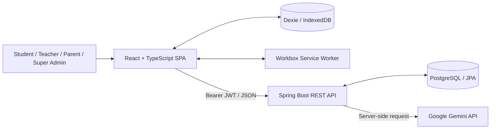
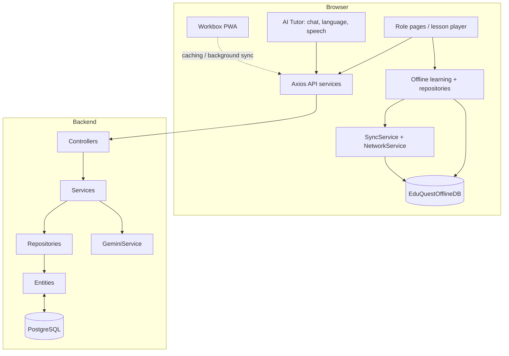
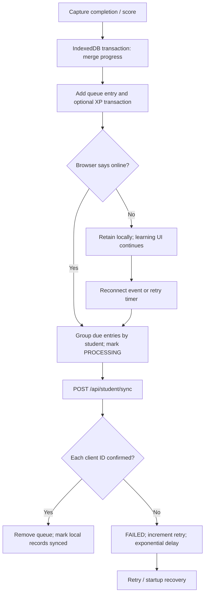
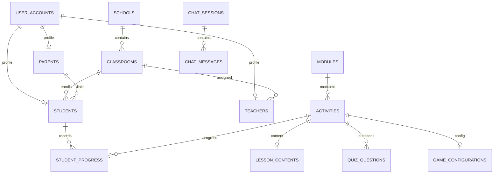

# EduQuest — Source-Grounded Project Documentation

**Audit basis:** checked-out source/configuration inspected on 25 September 2026. This report describes source, not an independently deployed production system. All feature claims should be read with the limitations below. Paths are relative to repository root.

## Executive Summary

EduQuest is a web-based school learning platform with student, teacher, parent and super-admin roles. Source implements lesson/activity and quiz delivery, teacher authoring, student progress, gamification, a multilingual Gemini-backed AI Tutor, and selected offline learning/synchronization paths. The frontend is a React/TypeScript SPA; the backend is Spring Boot with JPA/PostgreSQL. Dexie/IndexedDB holds local content and progress data, while a PWA service worker caches the app shell and selected requests.

The most substantiated engineering contribution is integrating cached learning content and queued progress capture with a role-based learning platform, gamification and a language-selectable AI tutor. The source does **not** prove comparative research novelty, learning efficacy, production-scale performance, or complete offline capability. Those require literature review and empirical tests.

**Counts:** 68 files under `frontend/src`; 153 Java files under `backend/src/main/java`; 27 JPA entities/tables; four roles; 96 annotated controller mapping methods (includes handler aliases; not normalized distinct URLs); ten IndexedDB stores; three progress/XP sync action types; seven unique route-rendered screens (AI Tutor has two aliases). Counts are source inventory, not quality metrics.

## 1. Project Overview

| Item | Evidence-grounded statement |
|---|---|
| Title | **EduQuest — Offline-First Gamified Learning Platform** (Vite manifest name in `frontend/vite.config.ts`; backend artifact `eduquest-backend`, `2.0.0-SNAPSHOT`). |
| Problem statement | The implemented problem space is continuity of school learning and progress tracking when connectivity is intermittent, together with engagement and tutor support. This is a synthesis of code features; no formal problem statement is stored in the repo. |
| Purpose | Deliver lessons, quizzes, activities/games and progress tracking; support teacher authoring, administrator management/analytics, parent child overview, and AI learning help. |
| Target users / domain | School learning: `STUDENT`, `TEACHER`, `PARENT`, `SUPER_ADMIN` (`backend/src/main/java/com/eduquest/domain/Role.java`). Classroom grade/section, subject, module and activity data support this domain. |
| Real-world problem addressed | Source implements learning content access and recording activity across connectivity changes, as well as class administration and learner engagement. Field impact is not measured. |
| Objectives reflected in code | Role-specific portals; lesson/quiz/game content; local cache and deferred progress sync; XP and related rewards; AI tutoring with lesson context and languages. |
| Scope | Browser SPA + Spring REST API + PostgreSQL + browser IndexedDB/Cache Storage + Gemini integration. No native mobile app or deployment pipeline description was identified in this source inventory. |
| Novelty / contribution | A plausible integration contribution is offline learning capture plus gamification and multilingual AI support. Novelty against prior work is **not established** by code; validate through literature review before publication. |

## 2. System Architecture

### Architecture description

- **Frontend:** React 18 / TypeScript SPA, React Router, Auth/Theme contexts, Tailwind, services and feature components. Entry `frontend/src/main.tsx`; routes/layout `frontend/src/App.tsx`.
- **Backend:** Spring Boot REST controllers delegate to domain services and Spring Data repositories; JPA entities persist to PostgreSQL. Entry `backend/src/main/java/com/eduquest/EduQuestApplication.java`.
- **Database:** PostgreSQL/JDBC + Hibernate/JPA; `spring.jpa.hibernate.ddl-auto: update` in `backend/src/main/resources/application.yml`. There is an AI SQL reference `backend/src/main/resources/schema-ai.sql`, but no comprehensive Flyway/Liquibase history is configured in `backend/pom.xml`.
- **Offline:** Dexie IndexedDB schema/repositories in `frontend/src/offline`; browser connectivity service and queue worker; server batch endpoint `/api/student/sync`.
- **AI:** separate `com.eduquest.ai` package: controller, validation DTOs, session/message entities/repositories, tutor service, language service, Gemini REST integration. Browser voice lives in `frontend/src/modules/ai`.
- **Authentication:** login returns JWT; browser stores token in localStorage and Axios attaches bearer header. JWT filter validates token and reloads account. Prefix RBAC in `SecurityConfig`.
- **PWA:** `vite-plugin-pwa`, auto-update, manifest, static asset precache, SPA navigation fallback, selected `NetworkFirst` GET and Workbox Background Sync for sync POST (`frontend/vite.config.ts`).

### High-level architecture diagram



### Component diagram



### Data flow and offline sync workflow

```mermaid
sequenceDiagram
  actor Learner
  participant UI as React UI
  participant IDB as IndexedDB
  participant API as Spring API
  participant PG as PostgreSQL
  participant G as Gemini
  Learner->>UI: Open lesson / quiz
  UI->>API: GET content (JWT)
  API->>PG: Load content
  PG-->>UI: Content DTO
  UI->>IDB: Cache content
  Note over UI,IDB: Offline path reads previously cached content
  Learner->>UI: Complete activity
  UI->>IDB: Transaction: update progress, queue sync, local XP
  UI->>API: POST /api/student/sync when online
  API->>PG: Apply accepted actions; per-item result
  Learner->>UI: Ask tutor question
  UI->>API: POST /api/ai/chat (+ optional lessonId/language)
  API->>G: Prompt and optional lesson content
  G-->>API: Text
  API->>PG: Persist user/AI messages
  API-->>UI: ChatResponse
```



## 3. Technology Stack

| Technology | Version declared/observed | Purpose |
|---|---|---|
| React / React DOM | `^18.3.1` | UI (`frontend/package.json`). |
| TypeScript | `^5.2.2` | Typed frontend/build. |
| Vite | `^5.2.11`; build observed 5.4.21 | Dev server and bundling. |
| React Router DOM | `^6.23.1` | SPA routing. |
| Tailwind CSS | `^3.4.3` | Utility styling. |
| Dexie | `^4.4.6` | IndexedDB abstraction. |
| Axios | `^1.6.8` | HTTP client. |
| lucide-react | `^0.378.0` | Icons. |
| vite-plugin-pwa | `^1.3.0` | Manifest, worker, Workbox caching. |
| Java | 17 | Backend target (`backend/pom.xml`). |
| Spring Boot | 3.2.5 | Backend runtime. |
| Spring MVC, Data JPA, Security, Validation | Boot-managed | REST, persistence, authorization, DTO validation. |
| Hibernate ORM | 6.4.4.Final observed at startup | JPA implementation. |
| PostgreSQL JDBC | Boot-managed | Database connection. |
| JJWT | 0.11.5 | JWT creation/validation. |
| BCrypt | Spring Security implementation | Password encoding. |
| Gemini API | default model `gemini-3.8-flash` | Server-side text generation. |
| Web Speech Recognition | Browser API | Voice-to-text for en/ta/hi; browser dependent. |
| Web Speech Synthesis | Browser API | AI voice output; browser/voice dependent. |
| Maven / Node | Not pinned as runtime versions by the manifests | Build tooling. |

## 4. Module Analysis

| Feature module | Purpose and major features | Primary tables / local stores | APIs / roles |
|---|---|---|---|
| Authentication/accounts | Login, identity, account/profile creation and assignment | `user_accounts`, `students`, `teachers`, `parents` | `/api/auth`, `/api/admin`; all roles login; admin ops Super Admin |
| Student learning | Profile, modules, activities, lessons, quizzes, games, progress | `students`, `modules`, `activities`, `lesson_contents`, `quiz_questions`, progress; local cache stores | `/api/student/**`; Student, Teacher, Super Admin per config |
| Teacher portal | Students/analytics, activity/module/content authoring, publish/archive, challenges | `teachers`, `classrooms`, `modules`, `activities`, content, game config, challenges | `/api/teacher/**`; Teacher/Super Admin |
| Parent portal | Parent profile and linked child overview | `parents`, `students`, progress/gamification | `/api/parent/**`; Parent/Super Admin |
| Super Admin | Accounts, classrooms, analytics, curriculum overview/seeding | user, school/classroom, learning tables | `/api/admin/**`; Super Admin |
| Curriculum/module | Subject/difficulty modules, module activities and progress | `modules`, `activities`, `student_module_progress` | student read, teacher author, admin curriculum |
| Lesson | Lesson content and completion | `activities`, `lesson_contents`, progress | `/api/student/lessons/**`; teacher content routes |
| Quiz | Question retrieval, submission, attempt score | `quiz_questions`, `student_quiz_attempts`, progress | student quiz routes; teacher question authoring |
| Game engine | Game-specific UI/configuration and submission | `activities`, `game_configurations`, progress/events | student game routes; teacher config |
| Gamification | XP, coins, levels, streaks, badges, missions, challenges, journey, ranking | student + gamification tables | `/api/student/gamification/**`, leaderboard |
| AI Tutor | Five modes, language, optional lesson context, history, voice | `chat_sessions`, `chat_messages`; language in localStorage | `/api/ai/**`; authenticated UI roles include all four |
| Offline sync | Cached content and local progress/XP plus queue/retry | 10 IndexedDB stores; backend `sync_queue` | `/api/student/sync`; learner path |
| PWA shell | Install metadata, shell/static cache, selected content cache and sync background queue | Cache Storage | Vite/Workbox; no API controller |

No distinct notification feature/API was found; do not describe notifications as implemented.

## 5. Role-Based Access Control

| Role | Source-supported responsibilities | UI routes | Backend authorization |
|---|---|---|---|
| `STUDENT` | Study, submit assessments, view progress/rewards, AI | `/student`, `/student/lesson/:id`, AI routes | `/api/student/**`; authenticated `/api/ai/**` |
| `TEACHER` | View class/student analytics, author learning content/challenges; student learning pages also allowed | `/teacher`, student/lesson pages, AI | `/api/teacher/**`, `/api/student/**`, AI |
| `PARENT` | View profile/child overview, AI | `/parent`, AI | `/api/parent/**`, AI |
| `SUPER_ADMIN` | Account/classroom/curriculum administration and analytics | `/admin`, other explicitly allowed routes, AI | `/api/admin/**`, `/api/teacher/**`, `/api/student/**`, AI |

`SecurityConfig` uses route-prefix rules: admin=Super Admin; teacher=Teacher/Super Admin; student=Student/Teacher/Super Admin; parent=Parent/Super Admin; auth paths permit all; all remaining routes require authentication. `JwtAuthenticationFilter` adds `ROLE_<role>`. AI extracts the account ID from the authenticated principal; history queries are scoped by user ID. Backend `/api/ai/**` requires authentication but does not apply a role allow-list.

| Capability | Student | Teacher | Parent | Super Admin |
|---|:---:|:---:|:---:|:---:|
| Student learning APIs | ✓ | ✓ | — | ✓ |
| Teacher APIs | — | ✓ | — | ✓ |
| Parent APIs | — | — | ✓ | ✓ |
| Admin APIs | — | — | — | ✓ |
| AI Tutor UI/API | ✓ | ✓ | ✓ | ✓ |

## 6. Database Analysis

### Persistence model and table inventory

PostgreSQL database `eduquest_v2` is configured at `127.0.0.1:5432`. `ddl-auto: update` is configured. The 27 tables below are the JPA entity inventory. Unless noted, `id` is the generated PK. Fields are Java entity properties; explicit `@Column`/`@JoinColumn` annotations control names, with Hibernate naming for remaining columns. Confirm exact physical PostgreSQL types/constraints against the target database before using as a production DDL appendix.

| Table | Purpose | Properties / key fields |
|---|---|---|
| `user_accounts` | Identity/login | `id` PK, `username` unique, `password`, `fullName`, `role`, `createdAt`, `updatedAt` |
| `schools` | School | `id`, `name`, `code`, timestamps |
| `classrooms` | Grade/section classroom | `id`, `grade`, `section`, `name`, `school` FK, timestamps |
| `students` | Learner profile/gamification state | `id`, `userAccount` FK unique, `classroom` FK, `parent` FK, `xp`, `level`, `coins`, `currentStreak`, `highestStreak`, `lastActiveDate`, timestamps |
| `teachers` | Teacher profile | `id`, `userAccount` FK unique, `classroom` FK, timestamps |
| `parents` | Parent profile | `id`, `userAccount` FK unique, inverse `students` collection, timestamps |
| `modules` | Learning module | `id`, `title`, `description`, `subject`, `difficultyLevel`, `estimatedMinutes`, `classroomId`, `status`, `createdByTeacherId`, timestamps |
| `activities` | Lesson/quiz/game metadata and ordering | `id`, `moduleId`, `title`, `description`, `subject`, `activityType`, `status`, `displayOrder`, `prerequisiteActivityId`, `unlockType`, `unlockValue`, `xpReward`, `visibleToStudents`, `aiGenerated`, `aiGeneratedBy`, `activityMetadataJson`, `createdByTeacherId`, `assignedClassroomId`, timestamps |
| `lesson_contents` | Lesson body | `id`, `activityId`, `content`, `estimatedMinutes`, timestamps |
| `quiz_questions` | Multiple-choice item | `id`, `activityId`, `questionText`, `optionA`–`optionD`, `correctAnswer`, `explanation`, `displayOrder`, timestamps |
| `game_configurations` | Activity game JSON | `id`, `activityId` unique, `jsonConfiguration`, timestamps |
| `student_progress` | Student/activity score/completion | `id`, `student` FK, `activity` FK, `score`, `completed`, `completedAt`, timestamps; unique student/activity |
| `student_activity_progress` | Rich progress aggregate | `id`, `studentId`, `activityId`, `completed`, `score`, `bestScore`, `attemptCount`, `completedAt`, timestamps; unique student/activity |
| `student_module_progress` | Module completion aggregate | `id`, `studentId`, `moduleId`, `completedActivities`, `totalActivities`, `completionPercentage`, `completed`, `completedAt`, timestamps; unique student/module |
| `student_quiz_attempts` | Quiz attempt/answer record | `id`, `studentId`, `activityId`, `score`, `totalQuestions`, `correctAnswers`, `answersJson`, `completedAt` |
| `student_activity_events` | Event history | `id`, `studentId`, `activityId`, `eventType`, `createdAt` |
| `student_xp_transactions` | XP ledger | `id`, `studentId`, `activityId`, `xpAwarded`, `reason`, `createdAt` |
| `student_coin_transactions` | Coin ledger | `id`, `studentId`, `coinsAwarded`, `reason`, `createdAt` |
| `student_badges` | Earned badges | `id`, `studentId`, `badgeCode`, `badgeName`, `earnedAt`; unique student/badge |
| `daily_missions` | Mission definitions | `id`, unique `missionKey`, `title`, `description`, `targetCount`, `xpReward`, `coinReward`, `createdAt` |
| `student_missions` | Student mission/date state | `id`, `studentId`, `missionKey`, `title`, `description`, `currentProgress`, `targetCount`, `completed`, `claimed`, `missionDate`, rewards, timestamps; unique student/key/date |
| `teacher_challenges` | Teacher/classroom challenge | `id`, `classroomId`, `teacherId`, `title`, `description`, `targetType`, `targetValue`, XP/coin/badge reward, `startDate`, `endDate`, `archived`, `createdAt` |
| `student_challenge_progress` | Student challenge state | `id`, `challengeId`, `studentId`, `currentProgress`, `completed`, `claimed`, `completedAt`, `updatedAt`; unique challenge/student |
| `sync_queue` | Server sync processing/dedupe | `id`, `clientQueueItemId`, `studentId`, `actionType`, `payloadJson`, `status`, `createdAt`, `processedAt` |
| `chat_sessions` | AI conversation metadata | `id`, `userId`, `title`, `mode`, `lessonId`, `createdAt`, `updatedAt` |
| `chat_messages` | AI/user messages | `id`, `session` FK (`session_id`), `sender`, `content`, `language`, `createdAt` |

**Relationships:** School→Classrooms; UserAccount→Student/Teacher/Parent one-to-one; Classroom→Student/Teacher; Parent→Students (inverse of students.parent); StudentProgress→Student/Activity; ChatSession→ChatMessages. `Module.activities`, lesson/question/config links, and many ledger/progress links use scalar IDs rather than declared JPA associations. Thus an ID field is not proof of a database-enforced FK. `schema-ai.sql` defines `chat_messages.session_id REFERENCES chat_sessions(id) ON DELETE CASCADE` and indexes session/user lookups.

### ER diagram (principal relations)



Some diagram links are conceptual scalar-ID links and are not all enforced FKs.

## 7. API Documentation

All APIs are JSON HTTP. `frontend/src/services/api.ts` attaches bearer JWT. Unless marked otherwise, auth is required. Request/response names below come from controller method signatures/DTOs; consult those source DTOs for all optional fields and validation details.

### Auth/admin/parent

| Method + route | Purpose | Body / response | Auth |
|---|---|---|---|
| `POST /api/auth/login` | Sign in | `LoginRequest(username,password)` → `LoginResponse(token,userId,username,fullName,role)` | No |
| `GET /api/auth/me` | Current user | none → `UserAccount` | Yes |
| `POST /api/admin/teachers`, `/students`, `/parents`, `/superadmins` | Create role accounts | `CreateUserRequest` → service result | Super Admin |
| `POST /api/admin/teachers/assign-classroom` | Classroom assignment | `AssignTeacherRequest` → result | Super Admin |
| `POST /api/admin/students/assign-parent` | Link parent | `AssignParentRequest` → result | Super Admin |
| `PUT /api/admin/students/{id}`, `/teachers/{id}` | Update accounts | `UpdateUserRequest` → result | Super Admin |
| `GET /api/admin/teachers`, `/students`, `/parents`, `/superadmins`, `/classrooms` | Admin lists | none → DTO lists | Super Admin |
| `GET /api/admin/analytics` | Admin analytics | none → `AdminAnalyticsDto` | Super Admin |
| `GET /api/admin/curriculum` | Curriculum overview | none → `CurriculumOverviewDto` | Super Admin |
| `POST /api/admin/curriculum/seed-demo` | Seed demo curriculum | none → operation result | Super Admin |
| `GET /api/parent/profile` | Parent profile | none → `ParentDto` | Parent/Super Admin |
| `GET /api/parent/child/{studentId}/overview` | Child overview | none → overview DTO | Parent/Super Admin; verify service ownership rule |

### Student

| Method + route | Purpose | Body / response | Auth |
|---|---|---|---|
| `GET /api/student/profile` | Student profile | none → DTO | Student/Teacher/Super Admin |
| `GET /api/student/activities` | Activity list | controller query options → activities | Same |
| `GET /api/student/modules` | Published modules | none → module DTO list | Same |
| `GET /api/student/modules/{id}/activities` | Module activities | none → list | Same |
| `GET /api/student/activities/{id}/lesson` | Lesson content | none → lesson DTO | Same |
| `GET /api/student/activities/{id}/quiz-questions` | Quiz questions | none → question list | Same |
| `GET /api/student/activities/{id}/game-config` | Game config | none → config DTO | Same |
| `GET /api/student/module-progress` | Module progress | none → list | Same |
| `GET /api/student/lessons/{id}` | Lesson detail | none → lesson/activity representation | Same |
| `POST /api/student/lessons/{id}/complete` | Complete lesson | completion request → result | Same |
| `GET /api/student/modules/{moduleId}/lessons` | Module lesson list | none → list | Same |
| `GET /api/student/continue-learning` | Continue learning | none → `ContinueLearningDto` | Same |
| `POST /api/student/quiz/submit` | Quiz submission | `SubmitQuizRequest` → score/result | Same |
| `GET /api/student/game/config/{activityId}` | Game setup | none → config | Same |
| `POST /api/student/game/submit/{activityId}` | Game result | result payload → response | Same |
| `GET /api/student/progress` | Progress records | none → DTO list | Same |
| `GET /api/student/progress/overview` | Progress overview | none → `StudentOverviewProgressDto` | Same |
| `GET /api/student/achievements` | Achievement summary | none → achievements | Same |
| `POST /api/student/progress` | Update progress | progress request → result | Same |
| `GET /api/student/leaderboard` | Leaderboard | query options → entries | Same |
| `GET /api/student/gamification/summary` | XP/level/streak/coin summary | none → summary DTO | Same |
| `GET /api/student/gamification/coin-history`, `/badges`, `/daily-missions`, `/weekly-challenges`, `/journey-map`, `/leaderboard` | Gamification reads | none → relevant DTO/list | Same |
| `POST /api/student/gamification/daily-missions/claim`, `/weekly-challenges/claim` | Claim reward | request → result | Same |
| `POST /api/student/sync` | Batch offline sync | `SyncRequestDto(studentId,items[])` → `SyncResponse(success,syncedItems,failedItems,errors)` | Student/Teacher/Super Admin |

### Teacher

| Method + route | Purpose | Body / response | Auth |
|---|---|---|---|
| `GET /api/teacher/profile`, `/students`, `/analytics` | Portal summary, roster and metrics | none → profile/list/`TeacherAnalyticsDto` | Teacher/Super Admin |
| `GET /api/teacher/activities` | List authored activities | filters → activity DTOs | Same |
| `POST /api/teacher/activities` | Create activity | `CreateActivityRequest` → DTO | Same |
| `PUT /api/teacher/activities/{id}` | Update activity | activity request → DTO | Same |
| `DELETE /api/teacher/activities/{id}` | Delete activity | none → result | Same |
| `POST` and `PUT /api/teacher/activities/{id}/publish` | Publish aliases | optional request → result | Same |
| `POST /api/teacher/activities/{id}/unpublish` | Unpublish | none → result | Same |
| `POST` and `PUT /api/teacher/activities/{id}/archive` | Archive aliases | none → result | Same |
| `POST` and `PUT /api/teacher/activities/{id}/restore` | Restore aliases | none → result | Same |
| `POST /api/teacher/activities/{id}/duplicate` | Duplicate activity | optional request → new activity | Same |
| `GET /api/teacher/modules` | List modules | none → module DTOs | Same |
| `POST /api/teacher/modules` | Create module | `CreateModuleRequest` → DTO | Same |
| `PUT /api/teacher/modules/{id}` | Update module | request → DTO | Same |
| `POST /api/teacher/modules/{id}/publish`, `/archive` | Change module state | none → result | Same |
| `POST /api/teacher/modules/{activityId}/lesson`, `/quiz-question`, `/game-config` | Author lesson, question, game config | respective DTO → result | Same |
| `GET /api/teacher/modules/{moduleId}/lessons` | Read module lessons | none → list | Same |
| `POST /api/teacher/modules/{moduleId}/lessons` | Add module lessons | lesson request → result | Same |
| `DELETE /api/teacher/modules/{id}` | Delete module | none → result | Same |
| `POST /api/teacher/challenges` | Create challenge | challenge request → DTO | Same |
| `PUT /api/teacher/challenges/{id}` | Update challenge | challenge request → DTO | Same |
| `DELETE /api/teacher/challenges/{id}` | Delete challenge | none → result | Same |
| `PATCH /api/teacher/challenges/{id}/archive`, `/restore` | Archive/restore | none → result | Same |
| `GET /api/teacher/challenges/classroom/{classroomId}`, `/my-challenges`, `/stats`, `/admin-stats` | Challenge lists/statistics | none → list/stats | Same route-prefix policy; verify method-level intent for admin-stats |

### AI Tutor

| Method + route | Purpose | Request / response | Auth |
|---|---|---|---|
| `POST /api/ai/chat`, `/explain`, `/simplify`, `/hint`, `/practice` | Five tutor modes | `ChatRequest` → `ChatResponse` | Authenticated |
| `GET /api/ai/sessions`, `/session-summaries` | List sessions/full summaries | none → session DTO list | Authenticated, scoped to account |
| `GET /api/ai/history/{sessionId}` | Session history | none → `ChatSessionDto` | Authenticated, owner check |
| `GET /api/ai/history/{sessionId}/messages?beforeId={cursor}` | Paginated messages (up to 50/page) | none → `ChatHistoryPage` | Authenticated, owner check |
| `GET /api/ai/languages` | Supported language list | none → list | Authenticated |
| `POST /api/ai/session?title=&mode=&lessonId=` | Create session | query params → session DTO | Authenticated |

`ChatRequest`: nonblank `message` max 4,000 chars; optional `sessionId`, `lessonId`, `action`, and allowed language code/name. `ChatResponse`: session ID, reply, message ID, timestamp. Exact field definitions live under `backend/src/main/java/com/eduquest/ai/dto` and `backend/src/main/java/com/eduquest/dto`.

## 8. Offline-First Implementation

### Dexie / IndexedDB stores

Database `EduQuestOfflineDB`; Dexie schema versions 2 and 3; v3 adds `xpTransactions` (`frontend/src/offline/db.ts`).

| Store | Key/indexes | Purpose |
|---|---|---|
| `students` | auto id; userAccountId, username | Profile snapshot. |
| `modules` | id; subject, difficulty, status, classroomId | Cached modules. |
| `activities` | id; moduleId, subject, activityType, status, order, prerequisite | Cached activity metadata. |
| `lessonContent` | id; activityId | Lesson body cache. |
| `quizQuestions` | id; activityId, displayOrder | Question cache. |
| `progress` | string id; studentId, activityId, synced | Local progress/version. |
| `moduleProgress` | string id; studentId, moduleId | Module aggregate. |
| `syncQueue` | string id; status, actionType, createdAt | Outbound work/status/retry data. |
| `settings` | key | Small settings and last-sync timestamp. |
| `xpTransactions` | string id; studentId, activityId, synced, createdAt | Local XP ledger. |

### Mechanism and evidence

| Area | Source behavior |
|---|---|
| Cached content | `offlineContentRepository` saves/reads lessons and quiz questions. Module/activity repositories cache lists. Student lesson and module services have online/offline branches. First-time uncached content is not available offline. |
| Progress | `offlineLearningService.recordActivityProgress` uses an IndexedDB transaction; max local score and OR completion; creates `COMPLETE_ACTIVITY` or `UPDATE_PROGRESS` queue records. |
| XP | On first local completion, creates deterministic local XP row `xp-{studentId}-{activityId}` and `EARN_XP` action; updates cached profile path. |
| Network detection | `networkService` listens to `online`/`offline`; `navigator.onLine` can indicate LAN/link but does not prove API reachability. |
| Queue | `syncService` filters due PENDING/FAILED rows, groups by student, max batch 50, marks PROCESSING, sends API request, deletes acknowledged items, marks progress/XP synced. |
| Retry | Exponential delay `min(1000 * 2^(retryCount-1), 5 minutes)`; records error, count and next attempt. Startup changes interrupted PROCESSING rows to FAILED. |
| Partial sync | Server response carries `syncedItems`, `failedItems`, `errors`; client only removes confirmed IDs. |
| Conflict | Client `mergeProgress` uses max score/best score, local OR remote completion, latest completion time and version=max+1. A matching end-to-end server merge/version response contract is not demonstrated; global convergence is therefore partial/unverified. |
| Dedupe | Server `SyncService` detects completed `clientQueueItemId`; `XpService` checks prior student/activity XP. This reduces duplicate risk but is not proof of distributed exactly-once behavior. |
| Service worker / PWA | `vite-plugin-pwa` auto-update, static asset glob, `/index.html` navigation fallback; `NetworkFirst` for selected student activity/module GETs (5s timeout, 150 entries, 24h); Workbox Background Sync configured for POST `/api/student/sync` with 24h retention. Browser runtime support is conditional. |
| Local preferences/auth | localStorage stores auth token/user and AI language/theme preferences; it is distinct from IndexedDB learning-content stores. |

### Offline checklist

| Item | Status | Evidence / limit |
|---|---|---|
| Lesson available after cached | Partial | Cache paths present; not uncached first visit. |
| Quiz questions available after cached | Partial | Cache paths present; offline submit/replay requires end-to-end test. |
| Progress local persistence | Implemented in source | Transactional IndexedDB write. |
| XP local persistence | Implemented in source | XP store and queue. |
| Queue/reconnect retry | Implemented in source | Queue plus online listener, timer, retry. |
| Processing recovery | Implemented in source | Startup recovery. |
| Conflict resolution | Partial | Client merge only proven from source. |
| PWA shell | Configured/buildable | Selected cache routes; no assertion of every page/data offline. |
| Offline dashboard parity | Partial | Several caches/repositories exist; every dashboard request/widget is not shown to use cache. |
| AI offline | Not supported | UI states internet required; lessons/quizzes are separate. |

**Source risks to validate:** server sync derives/accepts student ID from request/items and should be audited for binding to authenticated student; `EARN_XP` server path derives reward from activity reward and does not visibly consume the client `xp` amount; conflict merge is not confirmed on server; quest/quiz attempt replay is not evident in queue action list; browser offline events are not connectivity tests. These are code-review observations, not runtime findings from this documentation task.

## 9. AI Features

**Implemented:** `CHAT`, `EXPLAIN`, `SIMPLIFY`, `HINT`, `PRACTICE`; language choices English/Tamil/Hindi/Malayalam/Telugu/Kannada; per-user localStorage language choice; optional lesson ID loads activity title/description and up to 12,000 content characters; user/session history persisted in `chat_sessions` and `chat_messages`; history cursor page is up to 50 messages. Voice input via SpeechRecognition supports en/ta/hi only; output via SpeechSynthesis with language locale, pause/resume/stop. Both voice APIs depend on browser/OS support.

Flow: `useChat` sends `ChatRequest` through `aiService`; controller obtains authenticated user ID; DTO validates message size/language; `AiTutorService` sanitizes control chars, validates mode, persists user message and loads lesson context; `GeminiService` builds a language/mode/lesson prompt and calls Gemini; successful response is stored and returned.

Gemini key is server configuration (`GEMINI_API_KEY` fallback to Spring property); key is not required in frontend. Model default `gemini-3.8-flash`; request timeouts are configured (5s connect / 60s read), one retry for HTTP 429/5xx, HTTP errors mapped to safe messages; raw response bodies/key are not logged by the AI service.

**Not evidenced:** adaptive learner model, recommendations, diagnostic profiling, retrieval augmented generation, fine-tuning, generated activities saved to curriculum, AI quality/accuracy evaluation. Practice mode generates questions in the answer but is not demonstrated to persist quiz rows. Prompt-level untrusted-input wording is not a complete injection defense. Gemini needs internet, quota and valid model access.

## 10. Gamification

| Feature | Source implementation / formula |
|---|---|
| XP | `XpService.awardXp` persists transaction, increments learner XP and updates level; default lesson completion config 10 points, with per-activity `xpReward`. |
| Levels | `LevelService`: XP `<100` level 1; `<250` level 2; `<500` level 3; `<1000` level 4; `<2000` level 5; otherwise `5 + ((xp-1000)/1000)`. Test formula boundaries before presenting derived thresholds beyond level 5. |
| Coins | XP milestone conversion: `floor(newXP/100)*10 - floor(oldXP/100)*10`, i.e. 10 coins per 100-XP threshold crossed. |
| Streak | `StreakService` records activity, maintains current/highest streak and milestone bonus logic. Calendar/timezone edge policy should be verified in service before claiming exact semantics. |
| Badges | `BadgeService`: streak thresholds 3/7/30; XP 100/500/1000; level ≥5; coins ≥50. DB unique student/badge code. |
| Missions | Daily definitions and student/date progress; complete/claim state and XP/coin rewards. |
| Challenges | Teacher-defined class challenges, per-student progress and claim APIs. |
| Journey / leaderboard | `JourneyMapService` and leaderboard services/controllers expose progression and rankings. |
| Progress | Score/best score/attempt/completion and module completion percentage. |

No cash-out or monetary token behavior is represented by these systems.

## 11. Security

- `AuthService` issues JWT; `JwtTokenProvider` validates it; BCrypt is configured as Spring `PasswordEncoder`.
- JWT is stored in localStorage and attached by Axios; localStorage exposure to injected scripts and shared-device lifecycle are considerations.
- `JwtAuthenticationFilter` reloads account by username and assigns `ROLE_<enum>`; API is stateless.
- `SecurityConfig`: role-prefix policies plus auth permit-all; all other paths authenticated. CORS currently allows wildcard origin patterns with credentials; production should restrict origins.
- AI message constraints: nonblank, ≤4,000 chars, language regex, action allow-list, authenticated identity; history ownership query scoped to user. Prompt treats message/lesson text as data, not overriding instructions; this is not a full prompt injection defense.
- Gemini key is server-side configuration. `application.yml` also includes a static JWT secret and development PostgreSQL credentials; replace with managed environment secrets before deployment and rotate if ever exposed in a reachable environment.
- IndexedDB/localStorage are browser persistence and are not encrypted at rest in source. Rate limiting and comprehensive audit logging are not evidenced.

## 12. Project Statistics

| Metric | Count | Definition |
|---|---:|---|
| Frontend source files | 68 | `frontend/src` files. |
| Backend Java files | 153 | `backend/src/main/java/*.java`. |
| Entity tables | 27 | JPA `@Entity` files. |
| API handler methods | 96 | annotated controller methods; aliases included. |
| Roles | 4 | Role enum. |
| Unique route-rendered screens | 7 | Login, admin, teacher, student dashboard, lesson player, parent, AI Tutor (two aliases). |
| TSX component files | 38 | Includes reusable widgets/components. |
| IndexedDB stores | 10 | Dexie v3 schema. |
| Sync action types | 3 | COMPLETE_ACTIVITY, UPDATE_PROGRESS, EARN_XP. |
| Product feature areas | 13 | Organizational grouping in Section 4, not separately deployed modules. |

## 13. Research Paper Inputs

### Journal-style draft framing (hypothesis, not validated result)

**Research gap to investigate:** Online learning systems may assume continuous connectivity, while offline persistence, progress synchronization, engagement mechanics and conversational tutoring are often treated as separate concerns. EduQuest source suggests an integration case combining selected IndexedDB learning caches, deferred activity progress, gamification, and multilingual AI tutoring. This gap must be validated by systematic literature review and named-system comparison; the source itself cannot establish it.

**Proposed system:** A React/Spring/PostgreSQL role-based school learning platform with Dexie local persistence and queued progress/XP synchronization, lesson/quiz/game activities, reward/progress services and Gemini-backed multilingual tutoring with optional lesson context.

**Potential technical contributions:** (1) indexed browser schema/repositories for content and learner work; (2) owner-grouped batch sync with per-item outcome and retry; (3) XP/coin/level/badge/streak/challenge persistence; (4) paginated AI session history with multilingual and lesson-aware prompts; (5) browser-native voice controls combined with server tutor.

**Existing-system limitation candidates:** connectivity-dependent content, work loss while disconnected, low progress visibility, and language access. Treat as hypotheses until cited literature supports them.

**Educational contribution:** Not measured by source. Evaluate task completion offline, quiz performance/retention, learner effort, AI answer quality and language fidelity, usability/accessibility, teacher acceptance. Define protocol, sample, instruments, and ethics before results.

**Comparison plan:** Compare against an online-only workflow, a local-first workflow without automatic queue sync, and non-AI support. Select cited platforms/papers after literature search. Report measured feature and outcome differences; do not claim superiority from code inventory.

**Limitations to disclose:** Multi-device merge, exactly-once XP, offline quiz submission, browser background sync, security ownership, language quality, and outcome effectiveness require testing/validation.

## 14. Review PPT Content

### Slide 1 — Introduction
- EduQuest is a role-based school learning platform.
- Lessons, quizzes, games, progress and AI study support.
- Web app with offline-capable learner data paths.

**Presenter notes:** Introduce capabilities shown in source. Avoid unmeasured learning-impact claims.

### Slide 2 — Problem Statement
- Connectivity interruptions can disrupt web learning.
- Learner progress should survive temporary disconnection.
- Students need learning support; teachers/parents need learning visibility.

**Presenter notes:** This framing is derived from project scope; cite literature before describing as a proven research gap.

### Slide 3 — Objectives
- Deliver role-specific learning and management pages.
- Provide lessons, quizzes, games and progress.
- Cache selected content and queue learner progress offline.
- Add multilingual AI assistance.

**Presenter notes:** Tie objectives to App routes, controller APIs and offline/AI modules.

### Slide 4 — Existing System
- Repository has no named external comparator.
- Source shows selected online APIs plus local caches/queue.
- PWA runtime rules cache shell and selected learning endpoints.

**Presenter notes:** Do not make general claims about competing products without citations.

### Slide 5 — Proposed System
- React SPA + Spring Boot API + PostgreSQL.
- Dexie for client persistence and queued sync.
- Gamification and Gemini-backed tutor.

**Presenter notes:** Explain both browser and server responsibilities.

### Slide 6 — Architecture
- React/TypeScript pages, feature services and contexts.
- Spring controllers → services → repositories.
- PostgreSQL entities; server-side Gemini client.

**Presenter notes:** Use Mermaid diagram from Section 2.

### Slide 7 — Technology Stack
- React, TypeScript, Vite, Tailwind, Dexie, Axios.
- Java 17, Spring Boot 3.2.5, JPA, Security, JJWT.
- PostgreSQL, Workbox PWA, Gemini API.

**Presenter notes:** Section 3 distinguishes manifest ranges and observed versions.

### Slide 8 — Database Design
- 27 JPA entity-backed tables.
- Learning, roster, progress, gamification and AI history.
- `ddl-auto:update`; AI SQL script only, not full migration history.

**Presenter notes:** Explain scalar ID versus declared FK distinction.

### Slide 9 — Offline-First
- Ten Dexie stores including content, progress, XP and queue.
- Local writes and per-item batch sync with retry.
- Cached-before-disconnect content only; complete offline parity remains validation work.

**Presenter notes:** Make the “cached content” limitation explicit.

### Slide 10 — AI Features
- Chat/explain/simplify/hint/practice.
- Six languages and optional lesson context.
- Session history and browser voice controls.

**Presenter notes:** Requires online backend/Gemini; speech API support varies.

### Slide 11 — Gamification
- XP, levels, coins, streaks, badges.
- Daily missions, weekly challenges, journey map, leaderboard.

**Presenter notes:** Share formulas only from service code; verify boundary behavior.

### Slide 12 — Implementation Status
- Core role/learning/gamification/AI source is present.
- Offline database, queue, retries and PWA config are present.
- Conflict convergence and total offline dashboard remain partial/unverified.

**Presenter notes:** Source presence is not equivalent to deployment validation.

### Slide 13 — Results
- 68 frontend files, 153 backend Java files, 27 entity tables.
- Prior local check: frontend/backend builds and authenticated AI reply/session succeeded.
- No controlled educational-outcome or complete offline-device study evidenced.

**Presenter notes:** Label build/chat smoke check as technical validation, not a research result.

### Slide 14 — Future Scope
- Validate offline quiz replay, sync ownership and XP idempotency.
- Add production migrations/configuration and browser test matrix.
- Measure AI quality and learning outcomes.

**Presenter notes:** Separate proposals from implemented functionality.

### Slide 15 — Conclusion
- EduQuest integrates school learning, gamification, offline data paths and AI tutoring.
- Browser-local and server-persistent storage cooperate through sync.
- Next steps are end-to-end validation and educational evaluation.

**Presenter notes:** Conclude with evidence-backed capabilities and remaining validation.

## 15. Project Status and Validation Summary

Percentages below are **source-feature coverage ratios**, not a weighted project-completion or production-readiness estimate. For mixed groups, one partial row counts as 0.5 and one present row as 1.0. Runtime correctness is not implied.

| Area | Checklist used | Coverage ratio | Status |
|---|---|---:|---|
| Roles/routes | Four enum roles and corresponding route guards | 4/4 = 100% source presence | Routes/config exist; production hardening separate |
| Learning/assessment offline | Cached lessons (partial), cached quizzes (partial), local progress (present), local XP (present); partial=0.5 | 3/4 = 75% weighted source coverage | Offline content and replay remain partial |
| Gamification | XP, coins, levels, streaks, badges, missions/rewards, progress, leaderboard, journey | 9/9 = 100% source presence | Code paths exist; no outcome/edge-case proof |
| AI Tutor | Chat/modes, Gemini backend, languages, lesson context, persisted history, voice input, voice output, adaptive learner model, persistent recommendation/content generation; first seven present, last two not evidenced | 7/9 ≈ 78% source presence | AI is online/provider/browser dependent; no adaptive model evidenced |
| Offline/PWA | Lesson cache (partial), quiz cache (partial), local progress, local XP, queue, network events, automatic sync, retry, conflict (partial), service worker config, IndexedDB, PWA manifest; partial=0.5 | 10.5/12 = 87.5% weighted source coverage | Offline is partial; runtime guarantees not fully verified |

### Completed in source

- Four roles, protected route structure, JWT authentication and role-prefix authorization.
- Student learning APIs/UI; teacher authoring/challenges; parent overview; admin account/analytics/curriculum routes.
- Gamification services and records; AI tutor modes/languages/lesson context/history/voice controls.
- IndexedDB schema/repositories, local progress and XP recording, sync queue/retry/recovery, server sync endpoint.
- PWA manifest/service worker and selected cache rules.

### Partially complete / pending

- Offline first-use content and complete dashboard parity.
- Offline quiz attempt persistence/replay/reconciliation.
- Server-side progress merge and true concurrent-device conflict contract.
- End-to-end exactly-once completion/XP under retries.
- Real-browser installed PWA, Background Sync, mobile speech permission/voice tests.
- Deployment-safe secrets, DB migration history, security hardening.
- AI quality, accessibility and educational outcome evaluation.

### Risks and mitigations

| Risk | Source indication | Suggested mitigation |
|---|---|---|
| Static JWT secret and dev DB credentials in YAML | `backend/src/main/resources/application.yml` | Use profile/env/secret manager, rotate if exposed, avoid production defaults. |
| Wildcard CORS with credentials | `SecurityConfig` | Restrict production origins. |
| Browser data stored unencrypted | IndexedDB/localStorage usage | Minimize PII, clear/partition on logout, add CSP/XSS protections and shared-device review. |
| Sync owner/XP parity | Server trusts request/item data patterns; XP server uses activity reward | Bind student to authenticated principal; use stable idempotency keys; test reward parity. |
| Partial conflict implementation | Client merge helper without proven server merge handshake | Define versioned server merge protocol and concurrent-device tests. |
| PWA/runtime variability | Selective caching and browser Background Sync | Test installed app, eviction/update and supported browsers. |
| AI provider dependency | Gemini requires internet/key/quota/model access | Keep actionable errors, monitor quota, consider provider abstraction. |
| Large JS chunk warning | Production build emitted >500 kB chunk warning | Consider route-level lazy loading; not a functional defect by itself. |

### Validation evidence boundary

Prior local validation in this workspace recorded a clean backend package, frontend production build, and authenticated `/api/ai/chat` returning a nonempty reply with a persisted session. This does not prove all 96 handler methods, complete offline behavior, all browser sync modes, or production availability. A formal offline validation must use a browser with DevTools offline mode, pre-cache lesson/quiz, inspect IndexedDB before/after reconnect, and verify server records/logs. Existing screenshot/report folders were not treated as evidence without verified run provenance.

## Viva Voce Questions and Suggested Answers

1. **What is EduQuest?** — A school learning platform with role portals, lessons, quizzes, games, progress, gamification, offline-capable data paths and AI tutoring.
2. **What does offline-first mean here?** — Selected cached content can be read and some progress/XP writes persist locally for later sync; the source does not make every feature or uncached lesson available offline.
3. **Why Dexie?** — It provides structured/indexed IndexedDB stores and schema versioning through a table-oriented API.
4. **How does sync work?** — Client batches due items by student, marks them processing, posts `/api/student/sync`, removes acknowledged items and retries unconfirmed ones with capped exponential backoff.
5. **How are conflicts merged?** — Client helper uses max scores, OR completion, newest completion time and incremented local version. Server-wide convergence remains unverified.
6. **How does auth work?** — Login issues JWT; Axios sends Bearer; backend filter validates and reloads the account; role prefix rules protect routes.
7. **How does lesson-aware AI work?** — Optional lesson ID loads activity title/description/content; up to 12,000 characters are provided as primary prompt context.
8. **Why backend Gemini integration?** — Keeps the API key outside the browser and centralizes provider request/error handling.
9. **What languages/modes?** — English, Tamil, Hindi, Malayalam, Telugu, Kannada; chat, explain, simplify, hint, practice.
10. **How does voice work?** — Browser SpeechRecognition for English/Tamil/Hindi; SpeechSynthesis reads responses and exposes pause/resume/stop. API/voice support varies.
11. **How is XP duplication reduced?** — Deterministic local transaction key and server student/activity duplicate check; sync also recognizes completed client IDs. Exactly-once semantics need retry/concurrency tests.
12. **How are levels/coins calculated?** — `LevelService` defines XP bands; XP milestone conversion awards 10 coins for every crossed 100 XP.
13. **What is the migration strategy?** — JPA schema auto-update plus an AI SQL reference; no comprehensive Flyway/Liquibase history was found.
14. **What does the service worker cache?** — Build assets and SPA fallback; NetworkFirst for selected student content endpoints; Background Sync configured for sync POST.
15. **What remains to validate?** — Offline quiz replay, ownership/XP sync, concurrent merge, browser PWA/voice compatibility, security hardening and learner outcomes.

## Source Reference Index

- Routes/bootstrap: `frontend/src/App.tsx`, `frontend/src/main.tsx`.
- Auth/API: `frontend/src/context/AuthContext.tsx`, `frontend/src/services/api.ts`, `frontend/src/components/ProtectedRoute.tsx`.
- Offline: `frontend/src/offline/db.ts`, `networkService.ts`, `offlineContentRepository.ts`, `offlineLearningService.ts`, `offlineProgressRepository.ts`, `offlineStudentRepository.ts`, `offlineXpRepository.ts`, `syncService.ts`.
- Learning cache: `frontend/src/services/moduleService.ts`, `frontend/src/pages/student/StudentLessonPlayer.tsx`, `frontend/src/services/syncApiService.ts`.
- PWA: `frontend/vite.config.ts`, `frontend/public/eduquest.svg`.
- AI UI: `frontend/src/modules/ai/*`.
- API controllers: `backend/src/main/java/com/eduquest/controller/*`, `backend/src/main/java/com/eduquest/ai/controller/*`.
- Domain/services/repositories: `backend/src/main/java/com/eduquest/domain/*`, `service/*`, `repository/*`.
- AI backend: `backend/src/main/java/com/eduquest/ai/*`.
- Security: `backend/src/main/java/com/eduquest/security/*`.
- Configuration/build: `backend/pom.xml`, `backend/src/main/resources/application.yml`, `frontend/package.json`, `frontend/vite.config.ts`.
- AI schema: `backend/src/main/resources/schema-ai.sql`.
- Tests present: `backend/src/test/java/com/eduquest/service/AdminUserCreationTest.java`, `backend/src/test/java/com/eduquest/config/SamacheerCurriculumSeederTest.java`.
