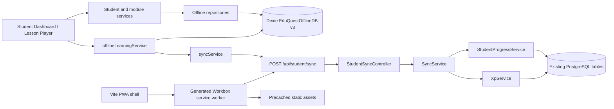

# EduQuest Offline-First Validation Report

**Implementation and validation date:** 2026-09-25  
**Environment:** local Windows workspace; Vite production preview on `127.0.0.1:4173`, Spring Boot 3.2.5/PostgreSQL backend on `localhost:8081` during online validation.  
**Scope:** additive offline learning support, existing API compatibility, IndexedDB persistence, synchronization, PWA shell, and runtime/build checks.

## Summary

Offline support has been extended across the existing Dexie, repository, service, and sync architecture. Frontend production build and backend package compilation passed. Online sign-in, dashboard loading, lesson reading, lesson completion, XP display, and an empty sync queue were observed in the browser. After stopping the backend, the already visited lesson and cached dashboard modules/activities still loaded from local data. This is evidence of API-outage fallback and local cache use, not a true browser network-disconnection test.

The demo student has no quiz activities, and the available browser control does not expose offline network emulation. Therefore offline quiz submission, queue upload after reconnect, and true offline-mode banner behavior remain unverified at runtime. The seeded student’s Geometry activity 197 was completed as part of the online test; this test record remains in the local database.

## Architecture and Data Flow

Online lesson/module/quiz requests are cached after a successful response. If a request fails or the browser reports offline, services read cached IndexedDB records. Progress, XP transactions, and queue records are written atomically before sync starts. Sync groups entries by student, posts batches, deletes only acknowledged IDs, retains failed entries, applies capped exponential backoff, and recovers interrupted `PROCESSING` records as retryable. The backend derives the student identity from the authenticated principal and rejects mismatched request/item ownership.

## Components Added or Extended

| Area | Files / classes | Change |
|---|---|---|
| IndexedDB | `frontend/src/offline/db.ts` — `EduQuestOfflineDB` | Additive schema version 3; preserves v2 stores and adds `xpTransactions`; adds local profile snapshot, activity metadata, progress version, and retry metadata fields. |
| Content cache | `frontend/src/offline/offlineContentRepository.ts` | Cache/read lesson content and quiz questions. Replaces cached quiz rows per activity. |
| Module cache | `frontend/src/offline/offlineModuleRepository.ts` | Cache/read student module catalog. |
| Activity/profile/progress/XP | `offlineActivityRepository.ts`, `offlineStudentRepository.ts`, `offlineProgressRepository.ts`, new `offlineXpRepository.ts` | Preserve and extend existing local repositories for offline retrieval, profile XP, merge policy, and pending XP. |
| Local learning write | `frontend/src/offline/offlineLearningService.ts` | Atomically saves progress, XP transactions, and sync queue actions. |
| Fetch fallback | `frontend/src/services/moduleService.ts`, `activityService.ts`, `studentLessonService.ts`, `studentService.ts` | Cache online responses and read cached modules, activities, lesson bodies, quizzes, and authenticated student profile on failure/offline. |
| Student UI | `StudentLessonPlayer.tsx`, `StudentDashboard.tsx` | Persist lesson/quiz/game progress locally, reflect pending XP, listen for network state, and display an offline banner when `navigator.onLine` is false. Existing visual styling is retained. |
| Client sync | `frontend/src/offline/syncService.ts` | Partial item acknowledgements, capped exponential retry, stale processing recovery, student-homogeneous batches, progress/XP synced state updates. |
| Backend sync | `StudentSyncController.java`, `SyncService.java`, `StudentProgressService.java` | Validate ownership, support `EARN_XP`, reject invalid activities/actions, keep the most recent completion timestamp. Existing authenticated sync endpoint is retained. |
| PWA | `frontend/vite.config.ts`, `frontend/package.json`, `frontend/package-lock.json`, `frontend/public/eduquest.svg` | Add Vite PWA plugin, manifest, static shell precache, NetworkFirst student module/activity GETs, and Workbox background-sync support for sync POSTs. |

No authentication/RBAC source was changed. No existing backend table or API route was removed or renamed. Database migration is additive in IndexedDB only; backend reuses existing progress, sync queue, and XP transaction persistence.

## Verification Matrix

| Capability | Status | Evidence |
|---|---|---|
| Lesson metadata and content cache | **PASS (source + API-outage runtime)** | Online Geometry lesson loaded with full text. With backend stopped, re-opening that already visited lesson still rendered its cached text. |
| Quiz questions cache | **PARTIAL** | Cache-on-fetch and offline repository fallback are implemented. Demo student has 0 quiz activities, so no quiz was available to exercise. |
| Offline quiz attempt and submission | **PARTIAL / NOT RUNTIME-VERIFIED** | Quiz handler uses local progress/queue flow, but no quiz activity and no browser network-offline mode were available. |
| Local progress and completion queue | **PASS (source + online runtime)** | Lesson completion changed to completed and dashboard reflected it. Queue returned to 0 pending after online sync. Progress writes are local-first. |
| Local XP ledger / immediate pending XP | **PASS (source)** | New `xpTransactions` store and atomic local XP/queue write; dashboard adds pending XP to the profile total. Offline XP behavior not manually forced in browser. |
| Automatic synchronization | **PARTIAL** | Enqueue and browser-online listeners trigger queue processing. Online lesson completion ended with no pending queue entries. Reconnect-trigger behavior was not tested with a real disconnection. |
| Partial batch acknowledgement | **PASS (source)** | Only `syncedItems` are removed; unacknowledged IDs remain retryable. |
| Retry/backoff/reload recovery | **PASS (source)** | Retry timestamps with exponential delay capped at 5 minutes; stale `PROCESSING` rows recover to `FAILED`. Timing/reload behavior not forced in runtime. |
| Queue ownership | **PASS (source)** | Authenticated student is authoritative; mismatched request or item student IDs are rejected. |
| Progress merge | **PARTIAL** | Local merge uses max score, OR completion, most recent completion timestamp, and increments a local revision. Backend persists max score/OR completion/latest timestamp. A persistent server-side version field is intentionally not added because existing DB schemas are preserved. |
| PWA manifest and shell | **PASS (build)** | Production output contains `manifest.json`, generated `sw.js` and Workbox bundle; generated worker precaches six shell assets. Browser page contains manifest link and inline SW registration. |
| Cached dashboard/modules | **PARTIAL (API-outage runtime)** | Cached modules, activities, lesson body, student identity/classroom appeared after backend stop. Gamification summary values such as coins/streak were not cached and displayed zero; offline completeness is not established. |
| Offline banner | **PARTIAL / NOT RUNTIME-VERIFIED** | Banner is wired to the browser `offline` event/`navigator.onLine`. Stopping only the backend does not change browser connectivity, so no claim is made that the banner was exercised. |
| Fresh launch while disconnected | **NOT VERIFIED** | PWA shell was built and service worker registered, but no true offline browser/network setting was exposed in the available browser controls. Existing authentication remains unchanged; a fresh sign-in still needs connectivity. |

## Runtime and Build Results

| Check | Result | Notes |
|---|---|---|
| `npm run build -- --outDir offline-validation-report/build` | **PASS** | TypeScript and Vite production build completed; PWA assets generated. Main JS bundle is about 625 KB and Vite emitted its standard >500 KB advisory. |
| `mvn -DskipTests clean package` | **PASS** | Backend compiled and packaged successfully. |
| `mvn test` | **FAIL (pre-existing fixture/data mismatch)** | 5 tests ran: 4 passed, 1 failed. `SamacheerCurriculumSeederTest.testCurriculumSeedingAndStudentVisibilityForClasses6To9` expected 4 Class 6 lessons but shared local DB returned 5. This is a seed/test database fixture mismatch, not a compile or offline-sync failure. |
| Online login/dashboard | **PASS** | Seeded student `student_6a_1` signed in and dashboard loaded. |
| Online lesson open/read | **PASS** | Geometry activity 197 title and full body rendered. |
| Lesson completion and XP | **PASS** | Completion action showed “Lesson Completed! Earned +25 XP!”; dashboard showed completed state and sync count zero. |
| Cached lesson/dashboard with backend unavailable | **PASS (limited outage fallback)** | Stopped local backend; lesson body and cached modules/activities still rendered. Browser continued to report Online Mode because its network connection remained up. |
| Quiz / true offline / reconnect sync | **NOT RUN** | No quiz for the demo user and no actual offline emulation toggle in the browser interface. |

## Database Changes

- Dexie database advances from version 2 to version 3 with the existing stores redeclared unchanged and a new `xpTransactions` object store.
- Existing browser data is upgraded additively by Dexie. No existing browser store is deleted or renamed.
- No SQL migration or existing PostgreSQL table modification was introduced. XP and sync reuse existing backend persistence.

## API Changes

No routes or request endpoint names changed. Existing sync endpoint remains `POST /api/student/sync`; the request supports the additive `EARN_XP` action and ownership is checked against the authenticated student. Existing lesson/module/quiz endpoints are unchanged and are now cached by their clients.

## Screenshots and Evidence Files

The in-session browser screenshots were visually inspected but no screenshot export-to-workspace operation was exposed by the available browser integration. Therefore no screenshot is claimed as a saved artifact. The production PWA build output is at `frontend/offline-validation-report/build` and contains the manifest/service worker assets. The demo completion is visible in the live local database and was not rolled back.

## Risks and Mitigations

1. **Offline-first proof is incomplete:** actual network disconnection and reconnect were not simulated. Run the checklist below in Chrome DevTools > Network > Offline or on an airplane-mode device before claiming full offline certification.
2. **Quiz runtime data absent:** seed or select a student with a published quiz and fetch it online once before testing its offline attempt flow.
3. **Gamification panels are partly remote-backed:** coin/streak values showed zero when the backend was stopped. Persist or derive these panels locally before claiming all dashboard counters work offline.
4. **Fresh login while disconnected:** authentication is intentionally untouched. A previously authenticated session can use local caches; logging in from a fresh session still requires the existing auth API.
5. **Backend test fixture shares local data:** run seeder tests against an isolated test database with a clean deterministic dataset; avoid changing business logic based on this fixture failure alone.
6. **Production bundle advisory:** inspect chunk boundaries if load performance becomes a concern; no code splitting was changed as part of this work.

## Manual End-to-End Checklist Still Required

- [ ] Sign in online and open each lesson/quiz needed offline once.
- [ ] Use browser Network Offline (or disable network on a test device); verify shell opens and Offline Mode banner appears.
- [ ] Open cached lesson and cached quiz; finish a lesson and quiz and verify local progress/XP and queue entries in IndexedDB.
- [ ] Restore network; verify sync requests, server records, queue clearing, and no duplicate XP/completions.
- [ ] Repeat after browser reload while offline to confirm persistent storage and stale `PROCESSING` recovery.
- [ ] Capture dashboard, lesson, quiz, IndexedDB, queue-before/after, network, and console screenshots into `offline-validation-report/screenshots`.

## Rollback Plan

1. Revert only the offline-specific frontend/backend files listed in the component table and the PWA dependency/config changes; retain unrelated worktree modifications.
2. Leave existing Dexie stores/data intact. If rolling back app code, old v2 clients can continue using existing stores; do not delete IndexedDB because that would discard pending learner work.
3. No backend schema rollback is required because no backend table migration was added.
4. Rebuild frontend and backend, then verify login, lesson/quiz APIs, and sync endpoint against the pre-change contract.

### Browser console observations

During the backend-stopped fallback check, the browser logged HTTP 500 failures for remote gamification summary and continue-learning endpoints, plus activity-service warnings that it was falling back to Dexie. Cached modules, activities, and the visited lesson still rendered. This confirms partial graceful degradation and also shows those two remote-only dashboard panels are not yet offline-backed.
